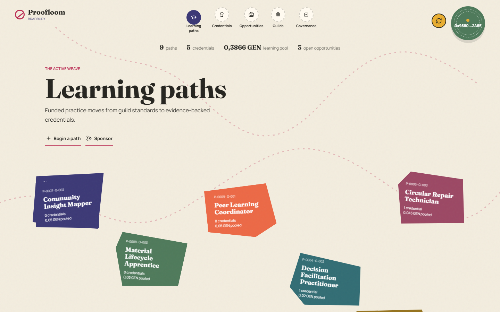
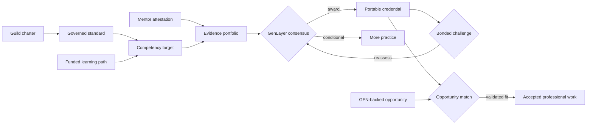

# Proofloom

**A guild-governed protocol for turning demonstrated practice into portable, challengeable, opportunity-bearing credentials.**

[Live application](https://abstrusimad.github.io/proofloom/) · [Bradbury contract](https://explorer-bradbury.genlayer.com/address/0x0a276053a8C68efCBB905df63A4a6903496Fc825) · [Source](https://github.com/AbstrusImad/proofloom)



## Pattern Legend

A conventional credential records that an institution approved somebody. Proofloom records the more useful story: which community defined competence, what the learner attempted, who observed the practice, which public artifacts support the claim, how independent validators interpreted the whole record, and whether later evidence challenged that conclusion.

The result is not a certificate generator. It is a professional learning market with governance, funded progression, adjudication, portable reputation, and paid opportunity matching. Its reasoning-heavy decisions run through GenLayer intelligent consensus and become inspectable Bradbury testnet state.

| Thread | What it coordinates |
| --- | --- |
| Guilds | Professional domains, charters, mentors, standards, and reputation |
| Learning paths | Bounded goals, portfolios, competency targets, and GEN grant pools |
| Practice proof | Mentor attestations plus project-specific public evidence |
| Credentials | Validator verdict, proficiency, confidence, reasoning, and grants |
| Challenges | Bonded objections and independent credential reassessment |
| Opportunities | Reserved rewards, applications, intelligent fit review, and acceptance |
| Governance | Standard proposals, one-wallet votes, closure, and epochs |

## Warp And Weft



Three kinds of judgment remain distinct:

- **Communities govern the rubric.** Guild members propose and vote standards.
- **People attest observed practice.** Authorized mentors publish accountable statements.
- **Validators interpret evidence.** GenLayer evaluates relevance, authenticity, reproducibility, independence, transferability, and rubric coverage.

That separation prevents one actor from defining competence, supplying all proof, and issuing the final credential alone.

## Live Sample Book

The Bradbury deployment begins with a deterministic migration snapshot of the state produced by 72 accepted StudioNet transactions. The source address and transaction count are recorded by the contract itself, while every new action continues through Bradbury consensus. The frontend reads contract state directly; it does not ship project fixtures.

| Live state | Count or value |
| --- | ---: |
| Guilds / mentors | 3 / 3 |
| Governed standards | 6 |
| Funded learning paths | 9 |
| Competency targets | 9 |
| Mentor attestations | 6 |
| Evidence records | 7 |
| Credentials | 6 total, 5 active |
| Opportunities / reviewed matches | 4 / 3 |
| Learning pools | 0.3866 GEN |
| Opportunity reserves | 0.29 GEN |
| Claimable value created | 0.1984 GEN |

Examples include an Evidence Systems Practitioner path, a Circular Repair Technician credential, a public-service research fellowship, a resolved bonded reassessment, and an accepted community repair residency.

## Intelligent Knots

Proofloom uses three project-specific consensus operations:

1. `review_competency` compares a target, active guild standard, portfolio evidence, mentor attestations, prior state, and reproducibility signals. It returns a normalized verdict, proficiency, confidence, grant proportion, and reasoning.
2. `resolve_challenge` weighs fresh challenge evidence against the credential's original basis. It can uphold, reassess, or revoke rather than merely echoing a generic LLM answer.
3. `review_match` evaluates whether current credentials durably satisfy a funded opportunity, records gaps, and produces a fit score before acceptance.

Each operation defines its own equivalence rule. Validators must agree on the categorical result while numeric scores remain within a bounded tolerance. This keeps consensus resilient to wording differences without treating materially different outcomes as equivalent.

## Contract Pattern

The intelligent contract contains 32 public methods: 13 reads and 19 state-changing operations.

**Formation and governance**

`register_guild` · `register_mentor` · `create_standard` · `vote_standard` · `close_standard`

**Learning and funding**

`create_path` · `update_portfolio` · `add_target` · `sponsor_path`

**Evidence and credentials**

`attest_practice` · `submit_evidence` · `review_competency` · `challenge_credential` · `resolve_challenge`

**Professional opportunity**

`publish_opportunity` · `apply_opportunity` · `review_match` · `accept_match` · `claim`

**Read surfaces**

`get_overview` · collection reads for every protocol record · `get_profile`

Value follows a pull-payment model. Grants and accepted opportunity rewards increase a claimable balance, and recipients withdraw through `claim`; no external transfer interrupts the state transition that created the entitlement.

## Interface Atelier

The landing follows one continuous thread through four distinct chapters: guild standards, evidence, intelligent consensus, and paid opportunity. Connecting a wallet opens a different spatial model, an archipelago of irregular cloth pieces linked by curved paths.

There is deliberately no sidebar, rectangular dashboard shell, tab strip, or card grid. Learning paths are fabric scraps, credentials are embossed medallions, guilds are blooms, standards form a ballot spiral, and opportunities flow as cut patterns. On mobile the free canvas becomes a vertical braid with a compact shuttle control.

Every write action uses the same visible lifecycle:

`wallet signature → Bradbury submission → validator consensus → accepted result or readable failure`

The animation stops when the receipt resolves, exposes the transaction hash, refreshes contract state, and never collapses a structured contract error into `[object Object]`.

## Run The Loom

Requirements:

- Node.js 22+
- pnpm 9.15+
- Python 3.12+ for contract tests
- A compatible GenLayer wallet funded with Bradbury testnet GEN

```bash
git clone https://github.com/AbstrusImad/proofloom.git
cd proofloom/app
pnpm install
pnpm dev
```

The frontend defaults to the live deployment. To point at another compatible deployment:

```bash
cp .env.example .env.local
```

Set `VITE_CONTRACT_ADDRESS` and `VITE_EXPLORER_URL`; never place a wallet private key in frontend environment variables.

## Verification

```bash
# Contract quality
genvm-lint check contracts/proofloom.py
pytest tests/direct -q

# Production frontend
cd app
pnpm build

# Live Bradbury snapshot
cd ..
pnpm verify:live

# Responsive browser matrix
node scripts/qa-ui.mjs
```

Verified in this repository:

- GenVM lint: 32 public methods recognized
- Direct contract tests: 12 passed, including exact migration-state coverage
- Production Vite build: passed
- Desktop and mobile: no horizontal overflow
- Five connected protocol areas: passed
- Wallet reconnection after reload: passed
- Browser console and page errors: zero

## Bradbury Deployment

```text
Network:     Testnet Bradbury
Chain ID:    4221
Contract:    0x0a276053a8C68efCBB905df63A4a6903496Fc825
Deploy tx:   0x8d4f857a8375b3fa0e2be8149372b3986caec31de65d5d31d10c3c82120ffd47
Deployer:    0x95803126315A05E642D8E46CE1d77eA2199a2A6E
```

The Bradbury constructor embeds 57 protocol records generated from the archived StudioNet live-state snapshot. Identifiers, lifecycle states, scores, counts, and economic balances are preserved; verbose historical narratives are normalized into concise on-chain summaries to respect Bradbury's publication limit. The complete source snapshot remains under `deployments/` for auditability.

## Repository Map

```text
contracts/proofloom.py       intelligent protocol
tests/direct/                deterministic direct-mode coverage
scripts/deploy-bradbury.mjs deployment utility
scripts/generate-migration-snapshot.mjs deterministic state migration
scripts/verify-bradbury.mjs complete live-state reader
scripts/qa-ui.mjs            responsive interaction audit
app/                         wallet-gated production frontend
deployments/                 Bradbury address, receipts, and live state
docs/                        verified interface capture
```

## Care Instructions

Proofloom credentials describe evidence evaluated against a community standard; they do not replace regulated licenses, background checks, employer due diligence, or direct human supervision where those are required. Guild governance should remain transparent, challenge bonds should be proportionate, and evidence should avoid exposing private learner or participant data.

## License

MIT
